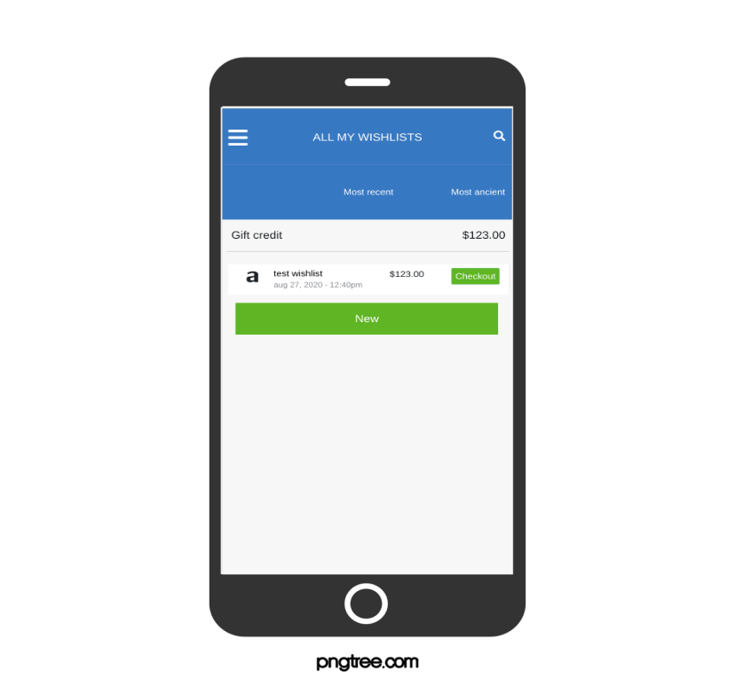

<p align="center">
    
</p>

<p align="center">
    <h1 align="center"> Group our Wishlist   </h1>    
</p>

<p align="center">
    <h2 align="center"> Web application with responsive behavior for mobile usage</h2>    
</p>


<p align="center">
    <a href="https://img.shields.io/badge/Microverse-blueviolet" alt="Contributors">
        </a>
    <a href="https://ruby-doc.org/core-2.7.0/Array.html" alt="Ruby">
        </a>
    <a href="https://rubyonrails.org/" alt="Rails">
        </a>
    <a href="https://www.rubydoc.info/gems/bootstrap-sass/3.3.6" alt="Bootstrap-sass">
        </a>
    <a href="https://rspec.info/documentation/" alt="Rspec-rails">
        </a>
    <a href="https://rubygems.org/gems/pg/versions/0.18.4?locale=es" alt="Postgresql">
        </a>
    <a href="https://www.heroku.com/" alt="Heroku">
        </a>
</p>

  <p align="center">    
    <br />
    <a href="https://github.com/othneildrew/Best-README-Template"><strong>Explore this project »</strong></a>
    <br />
    <br />&#10023;
    <a href="https://morning-taiga-75196.herokuapp.com/">View Demo</a>   &#10023;  
    <a href="https://github.com/rubenpazch/Group-our-transactions/issues">Report Bug</a>    &#10023;
    <a href="#Getting-Started">Getting Started</a> &#10023;
  </p>

<br/>

---

Group our Wishlist is a web application with responsive behavior for mobile usage
built with <b>Ruby on Rails</b> this application is based on an app for grouping payments by a goal with your family/friends you can find the full requirements   <a href="https://www.notion.so/microverse/Group-our-transactions-ccea2b6642664540a70de9f30bdff4ce" alt="Requirements">here</a>. Exploring this project you can find these options (<b>login</b>, <b> sign-in</b>,<b> all my wishlist</b>,<b> all my external wishlist</b>,<b> all groups and log out</b>, <b> check out a wish list as an additional feature</b>). 

It is required to sing in before to start using this application, Group our Wishlist is related with an online store where you buy some products, sometimes you just want to save some product that you want to review later, this is the basic idea about group our wishlist, <b> you can save a product wish</b>, groups allow you to separate your list of wish with a specific category. 

When you don't want to associate with any category you can create a wishlist that will be not associated with any group or category, finally check out is the extra feature added to be able to proceed with the check out for any of the products you saved.

---
<br/>

### Getting Started

This project was built using Ruby and Rails version 6, it is a web application and for running on your local environment you should follow these guidelines.

### Prerequisites

- Ruby 2.6.5
- Rails 6.0.3
- Bootstrap 
- Rspec 
- Jquery
- Faker
- Factory Bot
- Git

## Tools used on this project

- Visual Studio Code
- VSCode Ruby by Stafford Brunk
- Rubocop for Visual Studio Code

## The project

this project can be found in [github link](https://github.com/rubenpazch/Group-our-transactions) or you just can clone the project using this command 


```
# git clone  git@github.com:rubenpazch/Group-our-transactions.git
```

+ Open terminal on your workspace with

```
cd /home/project_folder/..
```

### Installing


To get started with the app, clone the repo and then install the needed gems:

```
# bundle install --without production
```

Next, migrate the database:

```
# rails db:migrate
```

Finally, run the test suite to verify that everything is working correctly:

```
# bundle exec rspec
```

If the test suite passes, you'll be ready to run the app in a local server:

```
$ rails server
```


## Watch the live version


click on the link to watch [live version](https://morning-taiga-75196.herokuapp.com/)


## Extra feature

+ Click on checkout 
+ press button payment
+ Notes.- After save the payment the wishlist will disappear from the list


## Screenshots of the app


## Contributing

contributions, issues, and feature requests are welcome!<br/>feel free to check [issues page](https://github.com/rubenpazch/Group-our-transactions/issues).

1. fork it (https://github.com/rubenpazch/Group-our-transactions/develop/fork)
2. create your working branch (git checkout -b [choose-a-name])
3. commit your changes (git commit -am 'what this commit will fix/add/improve')
4. push to the branch (git push origin [chosen-name])
5. create a new pull request


## Authors

👤 **Ruben Paz Chuspe**

- Github: [@rubenpazch](https://github.com/rubenpazch)
- Linkedin: [rubenpch](https://www.linkedin.com/in/rubenpch/)


### Show your support

Give a ⭐️ if you like this project!


## License

This project is licensed under the MIT License - see the [LICENSE.md](LICENSE.md) file for details

## Acknowledgments

* Hat tip to anyone whose code was used
* Inspiration
* etc
